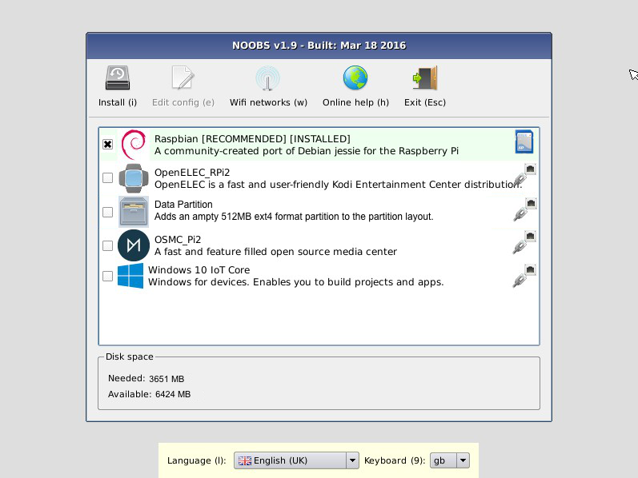
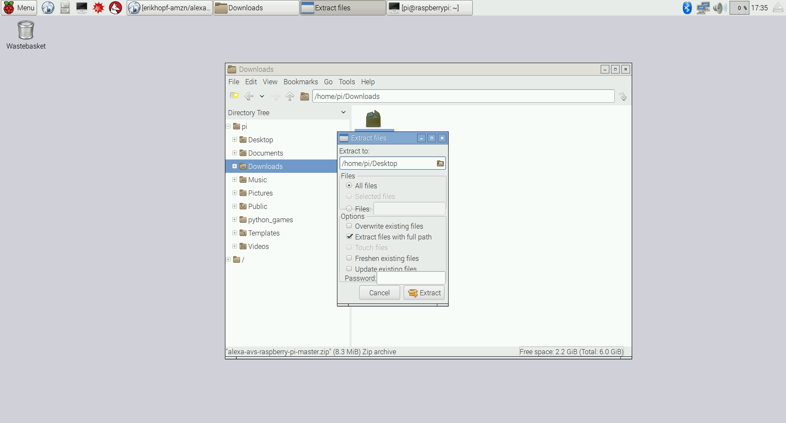
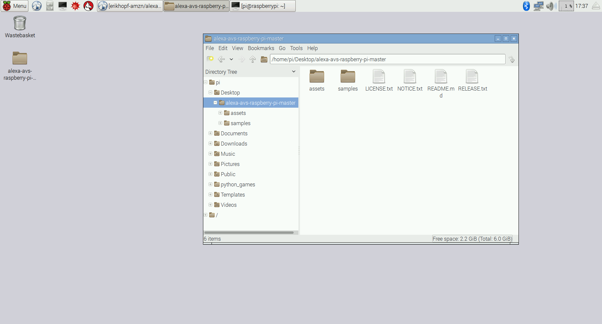
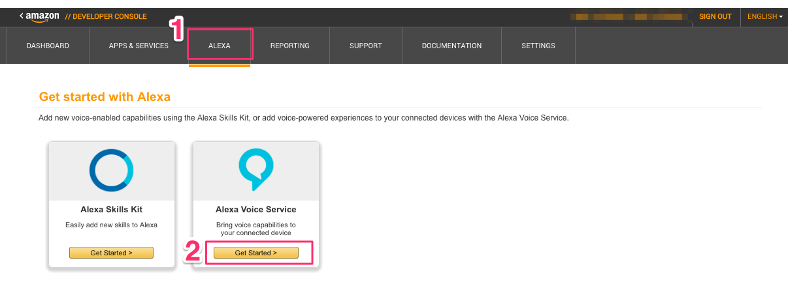
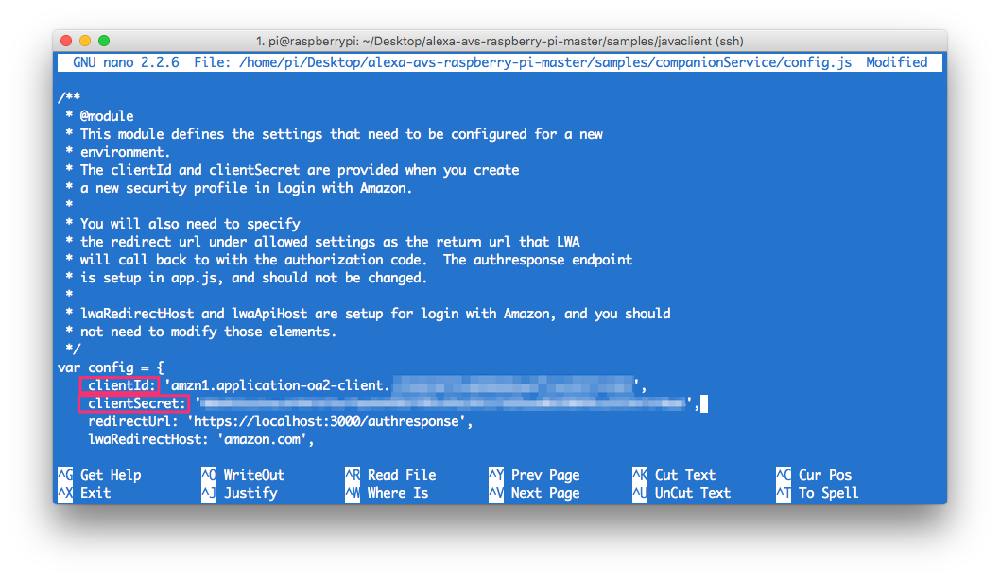
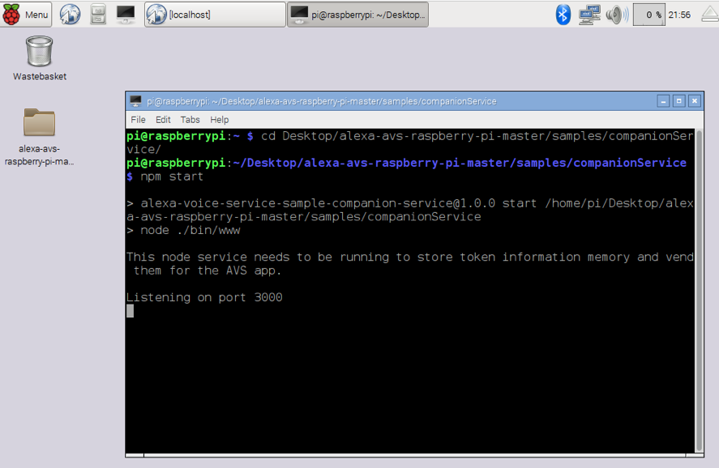
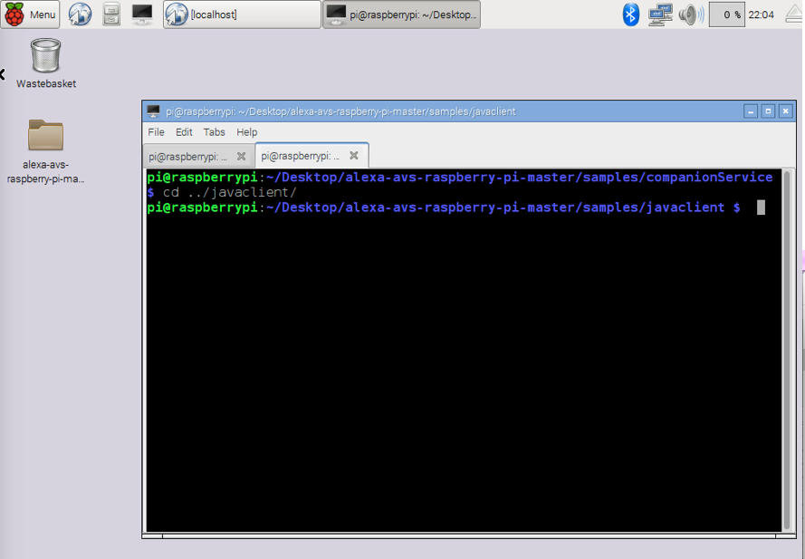
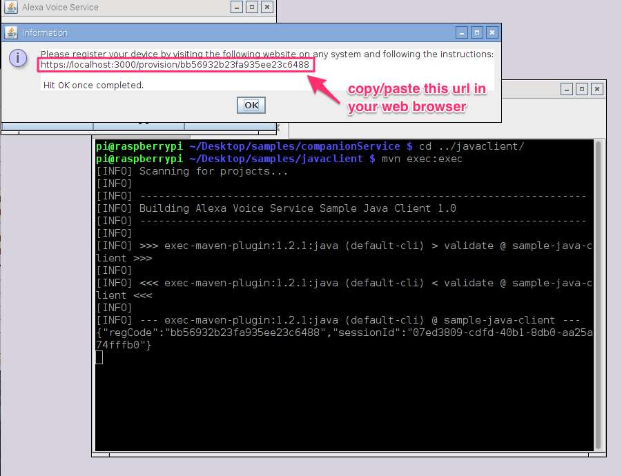

# Project: Raspberry Pi + Alexa Voice Service

**Update:** This project was updated 6/20/2016. Instructions have been adjusted per developer feedback, and where applicable values have been hard-coded to reduce setup time. *-AVS Team*

## About the Project
This project demonstrates how to access and test the Alexa Voice Service using a Java client (running on a Raspberry Pi), and a Node.js server. You will use the Node.js server to obtain a Login with Amazon (LWA) authorization code by visiting a website using your Raspberry Pi's web browser.

This guide provides step-by-step instructions for obtaining sample code, dependencies, and the hardware needed to run the reference implementation on your Pi. For Windows, Mac, or generic linux instructions, see [this guide](https://developer.amazon.com/public/solutions/alexa/alexa-voice-service/docs/java-client-sample).

___

## Getting Started

### Hardware you need

1. **Raspberry Pi 3 or Pi 2 (Model B)**  - Buy at Amazon - [Pi 3](https://amzn.com/B01CD5VC92) or [Pi 2](http://amzn.com/B00T2U7R7I).  
	**UPDATE**: Even though this guide was built using a Raspberry Pi 3, it should work fine with a Pi 2. Pi 1 users - please see this thread for [help](https://github.com/amzn/alexa-avs-raspberry-pi/issues/2).
2. **Micro-USB power cable** for Raspberry Pi (included with Raspberry Pi)
3. **Micro SD Card** - To get started you need an operating system. NOOBS (New Out Of the Box Software) is an easy-to-use operating system install manager for Raspberry Pi. The simplest way to get NOOBS is to buy an SD card with NOOBS pre-installed - [Raspberry Pi 8GB Preloaded (NOOBS) Micro SD Card](https://www.amazon.com/gp/product/B00ENPQ1GK/ref=oh_aui_detailpage_o01_s00?ie=UTF8&psc=1). Alternatively, you can download and install it on your SD card (follow instructions below).
4. **USB 2.0 Mini Microphone** - Raspberry Pi does not have a built-in microphone; to interact with Alexa you'll need an external one to plug in - [Buy at Amazon](http://amzn.com/B00IR8R7WQ)
5. **External Speaker** with 3.5mm audio socket/stereo headset jack - [Buy at Amazon](http://amzn.com/B007OYAVLI)
6. A **USB Keyboard & Mouse**, and an external **HDMI Monitor** - we also recommend having a USB keyboard and mouse as well as an HDMI monitor handy if for some reason you can’t “SSH” into your Pi. More on “SSH” later.
7. Internet connection (Ethernet or WiFi)
8. (Optional) WiFi Wireless Adapter for Pi 2 ([Buy at Amazon](http://www.amazon.com/CanaKit-Raspberry-Wireless-Adapter-Dongle/dp/B00GFAN498/)).
   **Note:** Pi 3 has built-in WiFi module.

### Skills you need

1. Basic programming experience
2. Familiarity with shell

### Assumptions (IMPORTANT - DO NOT SKIP)
This guide is based on the [convention over configuration](https://en.wikipedia.org/wiki/Convention_over_configuration) paradigm, which means that we’ve tried to reduce the number of decisions that you as a developer need to make to get the reference implementation running on your Pi, by hard coding configurations where applicable. Here are some assumptions we’ve made:  

- Hardware - You are using a Raspberry Pi 2 or 3
- OS - You are running *Raspbian Jessie*
- Naming conventions
	- Location: The location of your project files is `/home/pi/Desktop/alexa-avs-raspberry-pi-master/`
	- Product ID: `my_device`.
	- DSN: `123456`
	- Passphrase: is left blank

	**Note**: If you do not follow these conventions, you’ll need to manually update the following files and values:
	- `config.js` - location, product id, DSN
	- `config.json` - location, passphrase

---

##  0 - Setting up the Raspberry Pi

The first thing we’ll need to do is install *Raspbian Jessie* on our Pi. The easiest way to do that is by downloading **NOOBS**.

**What is NOOBS**?  
NOOBS is an easy operating system installer which contains Raspbian. It also provides a selection of alternative operating systems which are then downloaded from the internet and installed.

**NOTE:** If you already have Raspbian Jessie installed on your Pi, you may skip to [*Step 2 - Installing utilities - SSH, VNC Server, VLC, Node*](#2---installing-utilities---ssh-vnc-server-vlc-node) below.

### 0.1 - Downloading NOOBS

**NOTE**: If you have a micro SD card that came with NOOBS pre-installed, make sure it has *Raspbian Jessie* available as one of the install options. If not, follow the steps below to download the latest version of NOOBS.

1. Download the latest NOOBS zip file - [downloads.raspberrypi.org/NOOBS_latest](https://downloads.raspberrypi.org/NOOBS_latest)
2. Format the SD card using [SD Formatter](https://www.raspberrypi.org/help/noobs-setup/)
3. Drag and drop NOOBS files on to the SD Card: Once your SD card has been formatted, drag all the files from the extracted NOOBS folder and drop them onto the SD card drive.

### 0.2 - Installing Raspbian Jessie
1. Insert your micro SD card with NOOBS pre-installed into the micro SD card slot on your Pi.

2. Plug in the USB 2.0 Mini Microphone, and the (optional) WiFi Wireless Adapter.
3. Plug in your USB keyboard and mouse.
4. Connect your monitor using the HDMI port.

---

##  1 - Booting up the Raspberry Pi

1. Now plug in the USB power cable to your Pi.
2. Your Pi will boot, and a window will appear with a list of different operating systems that you can install.
3. Tick the box next to **Raspbian** and click on **Install**. Make sure it is Debian Jessie, and not Debian Wheezy.

	

4. Raspbian will run through its installation process.   
**Note:** This may take a while - get a cup of coffee (maybe brew a pot).
5. When the installation process is complete, the Raspberry Pi configuration menu (raspi-config) will load. Here you can set the time and date for your region and enable a Raspberry Pi camera board, or even create users. You can exit this menu using Tab on your keyboard to move to **Finish**.
	
6. Once rebooted, login to your Pi. The default login for Raspbian is username **pi** with the password **raspberry**

**NOTE:** To load the graphical user interface at any time type **startx** into the command line.

More info: [raspberrypi.org](https://www.raspberrypi.org/help/noobs-setup/)

___

## 2 - Installing utilities - SSH, VNC Server, VLC, Node

**NOTE**: You will be using the **Terminal** utility on your Raspberry Pi to install the utilities you need for this AVS walkthrough. Terminal comes preinstalled on the Raspberry Pi, and you can get to it from the Desktop. You can learn more about Terminal [here](https://www.raspberrypi.org/documentation/usage/terminal/).

### 2.1 - SSH into the Raspberry Pi
SSH allows you to remotely access the command line of your Raspberry Pi from another computer (as long as they are both on the same network). This removes the requirement to have an external monitor connected to your Pi.

**NOTE** SSH is **enabled by default** on Raspbian Jessie. If you run into problems getting SSH to work, make sure it’s enabled. This is done using the [raspi-config](https://www.raspberrypi.org/documentation/remote-access/ssh/README.md) utility.

So, let's SSH into your Raspberry Pi. To do that, you need to know the IP address of your Raspberry Pi.

Type this command into the terminal:

	hostname -I
	> 192.168.1.10 //this is an example Raspberry Pi’s IP - it would be different for you

If you’re on a Windows PC, follow the instructions here to [SSH Using windows](https://www.raspberrypi.org/documentation/remote-access/ssh/windows.md)

Now that you know the IP address of your Pi, you are ready to connect to it remotely using SSH. To do this, open the terminal utility on the computer you would like to connect from and type the following:

	ssh pi@<YOUR Raspberry Pi IP ADDRESS>

It will prompt you for your password. **NOTE**: the default password for the user pi is **raspberry**

Voila! You’re remotely connected to your Raspberry Pi. Now you can install all the utilities while connected remotely via SSH.

### 2.2 - Install VNC Server

VNC is a graphical desktop sharing system that will allow you to remotely control the desktop interface of your Raspberry Pi from another computer. This will come in very handy as you get rid of the external monitor connected to your Pi. Type:

	sudo apt-get install tightvncserver

**Start VNC Server**

To start VNC Server, type:

	tightvncserver

You'll be asked to set a password to access the Pi. You'll need this when you try to access the Pi from another computer, which we will be doing in a moment.

**Run VNCServer at Startup**

You want to make sure the VNC Server runs automatically after the Raspberry Pi reboots, so you don’t have to manually start it each time with the command *tightvncserver* through SSH. To do that, type the following in the terminal:

	cd /home/pi
	cd .config

Note the '.' at the start of the folder name. This makes it a hidden folder that will not show up when you type 'ls'.

	mkdir autostart
	cd autostart

Create a new configuration by typing the following command:

	nano tightvnc.desktop

Edit the contents of the file with the following text:

	[Desktop Entry]
	Type=Application
	Name=TightVNC
	Exec=vncserver :1
	StartupNotify=false

Type **ctrl-X** and then **Y**, and then press **Enter** to save the changes to the file.

That's it. The next time you **reboot**, the VNC server will restart automatically.

**Connecting to Raspberry Pi via VNC**

- **Mac**: See https://www.raspberrypi.org/documentation/remote-access/vnc/mac.md
- **Windows**: https://www.raspberrypi.org/documentation/remote-access/vnc/windows.md
- **Linux**: https://www.raspberrypi.org/documentation/remote-access/vnc/linux.md

**You may now disconnect the Monitor, keyboard and mouse (if you like)**. Now with SSH (allows remote access to the terminal) and VNC (allows you to remote control the Raspberry Pi’s desktop interface) installed, the external monitor is optional. Feel free to disconnect it from the Raspberry Pi.

### 2.3 - Install VLC

Get VLC media player by typing:

	sudo apt-get install vlc-nox vlc-data

**NOTE**: If you already have VLC installed, you will need to remove two conflicting libraries by running the following commands:

	sudo apt-get remove --purge vlc-plugin-notify
	sudo rm /usr/lib/vlc/plugins/codec/libsdl_image_plugin.so

**Unable to fetch errors**
If you run into some "Unable to fetch" errors while trying to install VLC, try the following: 	

	sudo apt-get update
	sudo apt-get upgrade
	sudo apt-get install vlc-nox vlc-data

**NOTE:** Running `sudo apt-get upgrade` might take a while. Grab a snack!

Source: https://www.raspberrypi.org/forums/viewtopic.php?f=66&t=67399

**Make sure VLC is installed correctly**

Type the following into the terminal:

	whereis vlc

This will provide you with the installation path.

Most programs are stored in `/usr/bin`. On my Pi, I see:

	vlc: /usr/bin/vlc /usr/lib/vlc /usr/share/vlc /usr/share/man/man1/vlc.1.gz

**Set the environment variables for VLC**

Type the following into the terminal:

	export LD_LIBRARY_PATH=/usr/lib/vlc
	export VLC_PLUGIN_PATH=/usr/lib/vlc/plugins

**Check if the environment variables were set successfully**

	echo $LD_LIBRARY_PATH
	> /usr/lib/vlc

	echo $VLC_PLUGIN_PATH
	> /usr/lib/vlc/plugins

---

## 3 - Download the sample app

### 3.1 - Register for a free Amazon Developer Account
[Get a free Amazon developer account](https://developer.amazon.com/login.html) if you do not already have one.

### 3.2 - Download the sample app and dependencies on your Raspberry Pi

[Download](https://github.com/amzn/alexa-avs-raspberry-pi/archive/master.zip) the sample app zip file from the [Github repo](https://github.com/amzn/alexa-avs-raspberry-pi.git). Please note that by downloading this package, you are agreeing to the [Alexa Voice Service Agreement](https://developer.amazon.com/edw/avs_agreement.html).

### 3.3 - Copy and expand the .zip file on your Raspberry Pi

1. Unless you downloaded the zip directly onto your Pi, copy and then expand the zip file on your Pi to `/home/pi/Desktop/alexa-avs-raspberry-pi-master/`.

---

## 4 - Installing dependencies - Node, JDK, Maven  

### 4.1 - Download and install Node.js

Type:

	sudo apt-get update && sudo apt-get upgrade

Set up the apt-get repo source:

	curl -sL https://deb.nodesource.com/setup | sudo bash -

Install Node:

	sudo apt-get install nodejs

## 4.2 - Install NPM

Change directories to `/home/pi/Desktop/alexa-avs-raspberry-pi-master/samples/companionService`

	cd /home/pi/Desktop/alexa-avs-raspberry-pi-master/samples/companionService

Install the dependencies:

	npm install

### 4.3 - Install Java Development Kit

You need to have Java Development Kit (JDK) version 8 or higher installed on your Pi. To make things easier, we've included a script that will install the latest version of JDK on your Pi and remove older JDK versions.

Goto:

	cd /home/pi/Desktop/alexa-avs-raspberry-pi-master/samples/javaclient

Run the installation script:

	./install-java8.sh

This might take a while. Grab another coffee!

You will get a message from Oracle Java installer that you must accept the Terms of Service for Java SE Platform, press **Enter**. Then, press **Tab**, and then **Enter** to say “**Yes**” to the Terms of Service.

**Step 3: Verify your version of JDK**

Now verify the commands with the -version option:

	java -version
	>> java version "1.8.0_91"
	>> Java(TM) SE Runtime Environment (build 1.8.0_91-b14)
	>> Java HotSpot(TM) Client VM (build 25.91-b14, mixed mode)

	javac -version
	>> javac 1.8.0_91

**Step 4: Make sure your JDK and ALPN versions match**

Using the File Manager on the Pi, navigate to the following directory:

	/home/pi/Desktop/alexa-avs-raspberry-pi-master/samples/javaclient

In a text editor, open `pom.xml` and locate `<alpn-boot.version>xxx</alpn-boot.version>`. Confirm the ALPN version matches your JDK version using the table located at [eclipse.org/jetty](http://www.eclipse.org/jetty/documentation/current/alpn-chapter.html#alpn-versions). If the versions match no further action is required. If the versions **do not** match, update the `pom.xml` file with the correct ALPN version and save.

### 4.4 - Install Maven

**Step 1: Download Maven**

Download the Binary tar.gz file [apache-maven-3.3.9-bin.tar.gz](http://www.interior-dsgn.com/apache/maven/maven-3/3.3.9/binaries/apache-maven-3.3.9-bin.tar.gz) from [maven.apache.org](https://maven.apache.org/download.cgi)

**Step 2: Extract the contents**

Goto:

	cd /home/pi/Downloads

Extract the contents of the tarball to the /opt directory

	sudo tar xvf apache-maven-3.3.9-bin.tar.gz	-C /opt

**Step 3: Tell your shell where to find maven**
You’ll do this in the system profile settings so it is available to all users.

Create a new file /etc/profile.d/maven.sh, by typing the following in the terminal:

	sudo touch /etc/profile.d/maven.sh
	sudo nano /etc/profile.d/maven.sh

In the editor, add the following to maven.sh:

	export M2_HOME=/opt/apache-maven-3.3.9
	export PATH=$PATH:$M2_HOME/bin

Type **ctrl-X** and then **Y**, and then press **Enter** to save the changes to the file.

Log out and back into the Pi so the profile script takes effect. You can test that it is working with the following command:

	mvn -version
	>> Apache Maven 3.3.9

---

## 5 - Generate self-signed certificates

**Step 1: Install SSL**

Get openssl:  

	sudo apt-get install openssl

**Verify install**

	whereis openssl
	> openssl: /usr/bin/openssl /usr/share/man/man1/openssl.lssl.gz

Change directories to `/home/pi/Desktop/alexa-avs-raspberry-pi-master/samples/javaclient`.

	cd /home/pi/Desktop/alexa-avs-raspberry-pi-master/samples/javaclient

**Step 2**: Run the certificate generation script:

	./generate.sh

**Step 3**: You will be prompted for some information:

These must be entered **exactly** as they appear below. See **Assumptions** above for more info on this.

1. When prompted for a product ID, enter **my_device**
2. When prompted for a serial number (DSN), enter **123456**
3. When prompted for a password, press **enter** to leave it blank.

A private key would be generated for you.

---

## 6 - Getting started with Alexa Voice Service

### 6.1 - Register your product and create a security profile.

1. Login to Amazon Developer Portal - [developer.amazon.com](https://developer.amazon.com/login.html)
2. Click on Apps & Services tab -> Alexa -> Alexa Voice Service -> Get Started

3. In the Register a Product Type menu, select **Device**.
	
4. Fill in and save the following values:

**Device Type Info**

1. Device Type ID: **my_device**
2. Display Name: **My Device**
3. Click **Next**

**Security Profile**

1. Click on the Security Profile drop down and choose “**Create a new profile**”
	

2. **General Tab**
	- **Security Profile Name**: Alexa Voice Service Sample App Security Profile
	- **Security Profile Description**: Alexa Voice Service Sample App Security Profile Description
	- Click **Next**

	

   Client ID and Client Secret will be generated for you.

3. Now click on the **Web Settings Tab**
	- Make sure the security profile you just created is selected in the drop-down menu, then click the **"Edit"** button.

	
	- **Allowed Origins**: Click "**Add Another**" and then enter **https://localhost:3000** in the text field that appears.
	- **Allowed Return URLs**: Click "Add Another" and then enter **https://localhost:3000/authresponse** in the text field that appears.
	- Click **Next**

**Device Details**

1. Image: Save the following test image to your computer, then upload it:

2. Category: **Other**
3. Description: **Alexa Voice Service sample app test**
4. What is your expected timeline for commercialization?: **Longer than 4 months / TBD**
5. How many devices are you planning to commercialize?: **0**
6. Click **Next**

**Amazon Music**

1. Enable Amazon Music?: No (You may optionally select Yes and fill in the required fields if you want to experiment with Amazon Music. However, Amazon Music is not required for basic use of the Alexa Voice Service.)
2. Click the Submit button

You are now ready to generate self-signed certificates.

---

### 6.2 - Enable Security Profile

1. Open a web browser, and visit [https://developer.amazon.com/lwa/sp/overview.html](https://developer.amazon.com/lwa/sp/overview.html).

2. Near the top of the page, select the security profile you created earlier from the drop down menu and click **Confirm**.

3. Enter a privacy policy URL beginning with http:// or https://. For this example, you can enter a fake URL such as http://example.com.
4. [Optional] You may upload an image as well. The image will be shown on the Login with Amazon consent page to give your users context.
5. Click Save.

	

6. Next to the Alexa Voice Service Sample App Security Profile, click Show Client ID and Client Secret. This will display your client ID and client secret. Save these values. You’ll need these.

---

## 7 - Update the config files

**Login to the Raspberry Pi via VNC**

Open config.js:

	nano /home/pi/Desktop/alexa-avs-raspberry-pi-master/samples/companionService/config.js

  

Edit the following values:

- **clientId**: Paste in the client ID that you noted in the previous step as a string.
- **clientSecret**: Paste in the client secret that you noted in the previous step as a string.

While pasting the values, be careful to enclose them in **single quotes**.

Type **ctrl-X** and then **Y**, and then press **Enter** to save the changes to the file.

___

## 8 - Run the server

[**IMPORTANT: This must be done via VNC, not SSH. So, make sure you’re logged into your Pi via VNC.**]

**Login to the Raspberry Pi via VNC**

In your terminal window, type:

	cd /home/pi/Desktop/alexa-avs-raspberry-pi-master/samples/companionService
	npm start

The server is now running on port 3000 and you are ready to start the client.

___

## 9 - Start the client  

[**IMPORTANT: This must be done via VNC, not SSH. So, make sure you’re logged into your Pi via VNC.**]

Open a new terminal window/tab (SHIFT+CTRL+T in Raspbian) and navigate to:

	cd /home/pi/Desktop/alexa-avs-raspberry-pi-master/samples/javaclient

**Build the app**

Download dependencies and build the app by typing:

	mvn install

When the installation is completed, you will see a “Build Success” message in the terminal.

**Run the client app**:

You are now ready to run the client app by typing:

	mvn exec:exec

## 10 - Obtain Authorization from Login with Amazon

1. When you run the client, a window should pop up with a message that says something similar to:  

	*Please register your device by visiting the following website on any system and following the instructions: https://localhost:3000/provision/d340f629bd685deeff28a917 Hit OK once completed*.

	**DO NOT CLOSE THIS WINDOW YET**

	

	**Copy** the URL from the popup window and **paste** it into a **web browser**. In this example, the URL to copy and paste is https://localhost:3000/provision/d340f629bd685deeff28a917.

	
**NOTE:** Due to the use of a self-signed certificate, you will see a warning about an insecure website. This is expected. It is safe to ignore the warnings during testing.

2. You'll be taken to a Login with Amazon web page. Enter your Amazon credentials.

	

3. You'll be taken to a Dev Authorization page, confirming that you’d like your device to access the Security Profile created earlier.

	

	Click **Okay**.

4. You will now be redirected to a URL beginning with https://localhost:3000/authresponse followed by a query string. The body of the web page will say **device tokens ready**.

	

5. **Return to the Java application** and click the **OK** button. The client is now ready to accept Alexa requests.
	

6. Click the **Start Listening** button and wait for the **audio cue** before beginning to speak. It may take a second or two before you hear the audio cue.

	

Press the **Stop Listening** button when you are done speaking.

___

## 11 - Let’s talk to Alexa  

**Ask for Weather**:
*Click the Start Listening button*.
**You**: What's the weather in Seattle?
*Click the Stop Listening button*.
**Alexa**: Current weather report for Seattle

**Some other fun questions you can ask Alexa**

Once you hear the audio cue after clicking “Start Listening” button, here are a few things you can try saying -

- **Request Music Playback**: Play Bruce Springsteen
- **General Knowledge**: What's the mass of the sun in grams?
- **Geek**: What are the three laws of robotics?
- **Fun**: Can you rap?
- **Set a Timer**: Set the timer for 2 minutes.
- **Set Alarm**: Set the alarm for 7:30 a.m.

**More on Music Playback**
The "previous", "play/pause", and "next" buttons at the bottom of the Java client UI are to demonstrate the music button events. Music button events allow you to initiate changes in the playback stream without having to speak to Alexa. For example, you can press the "play/pause" button to pause and restart a track of music.

To demonstrate the "play/pause" button, you can speak the following command: Play DC101 on iHeartRadio, then press the "play/pause" button. The music will pause in response to the button click. Press the "play/pause" button again to restart the music.

___

## 12 - FAQs

### I got the Raspberry Pi working with AVS, but I can’t hear the audio response from Alexa

Check to see if you are seeing the response coming through on the Terminal and if you see the response cards on your Alexa app. If yes, you probably need to force audio through local 3.5mm jack, instead of the HDMI output (this can happen even if you don’t have an HDMI monitor plugged in).

To force audio through local 3.5 mm jack, open Terminal, and type

	sudo raspi-config

See [Raspberry Pi Audio Configuration](https://www.raspberrypi.org/documentation/configuration/audio-config.md)

### How do I find the IP address of my Raspberry Pi?

	hostname -I

### Unable to fetch errors -
If you run into some "Unable to fetch" errors while trying to install VLC, try the following - 	

	sudo apt-get update
	sudo apt-get upgrade
	sudo apt-get install vlc-nox vlc-data

### Having issues with npm
If you run into some "npm not found" errors after installing node (older versions of Raspbian's node), try the following -

	sudo apt-get update
	sudo apt-get upgrade
	sudo apt-get install npm

### What if I cannot find an ethernet port for the pi?

Check out this url on how to bridge the connection between a laptop's wifi connection and the ethernet port on your pi.
https://www.hackster.io/Anwaarullah/sharing-wifi-with-raspberry-pi-using-a-lan-cable-ae1f44

### What does the ssl.cnf file look like?
[Here's](https://gist.github.com/ajotwani/a0d54110a968c984fd0b) what the ssl.cnf file would look like, replacing country, state, locality with your respective info.

###  “Cannot connect to the Companion Service” errors
This could be because of one of 3 things -

1. **Bad certificate** - which could be a result of -
	- Bad ssl.cnf file (See FAQ above for what it should look like),
	- incorrect java version,
	- possibly wrong passphrase in the config.json file,

2. **Incorrect Product id** - Make sure that these values are the same -
	- Device Type Info -> [Device Type ID](https://github.com/amzn/alexa-avs-raspberry-pi#34-register-your-product-and-create-a-security-profile) on the Amazon Developer Portal, and
	- Product ID in SSL cert generation (when prompted by [generate.sh](https://github.com/amzn/alexa-avs-raspberry-pi#4---generate-self-signed-certificates)), and
	- Product ID in [config.json](https://github.com/amzn/alexa-avs-raspberry-pi/blob/master/samples/javaclient/config.json)
	- the "key" in the products "key":["value"] pair in [config.js](https://github.com/amzn/alexa-avs-raspberry-pi/blob/master/samples/companionService/config.js), and

3. **Incorrect DSN** - Make sure that these values are the same -
	- dsn in [config.json](https://github.com/amzn/alexa-avs-raspberry-pi/blob/master/samples/javaclient/config.json), and
	- the "value" in the products "key":["value"] pair in [config.js](https://github.com/amzn/alexa-avs-raspberry-pi/blob/master/samples/companionService/config.js)

4. The Companion Service isn’t actually [running](https://github.com/amzn/alexa-avs-raspberry-pi#8---run-the-server).

___

## 13 - Release Notes

### (2016/05/17)

* Reduced total number of steps to complete project.
* Hard-coded certificate paths.
* Included instructions for matching ALPN and JDK versions.
